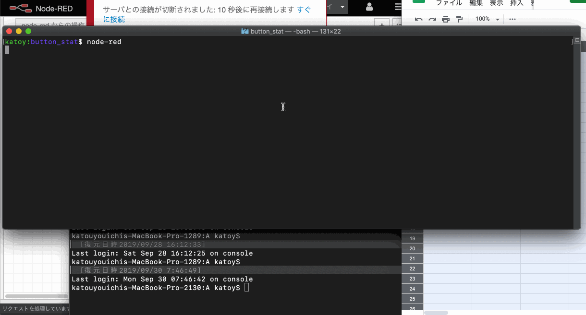

# button-state

これは Mac 上では走らせた node-red と M5Stack, google^spredsheet でやり取りをする例です。

1. node-red の上でイベントをお越して、M5Stack のLCD の背景色を変更する。
2. M5Stack のボタン A, B, C の押下を googleスプレッドシートに記録する。

google スプレッドシートの準備は
- [http://jellyware.jp/kurage/raspi/google_spreadsheet.html]()
ラズパイからGoogleスプレッドシートへ送信
を参照してください。

M5Stack の LCD 背景色の制御は
- [https://www.1ft-seabass.jp/memo/2018/05/10/m5stack-meets-nodered-with-mqtt/]
M5StackとNode-REDをMQTTで連携するメモ
を参照してください。

1. googl シートを作成し、Web アプリケーションを用紙する。

2. m5stack には Arduino で button_stst/button_stst.ino を読み込み, M5Stack に download する。
   戦闘部にある MQTT の接続先は適宜 環境に合わせて編集する事。

3. mac では、 npm で node-red をインストールする。
参考 [https://nodered.jp/docs/getting-started/local]

4. node-red で button_state/flows.json を読み込む。
  http-requewt ノードの giigle スプレッドシートのアプリケーション URL を環境に合わせて編集する事。

4.デプロイする。

